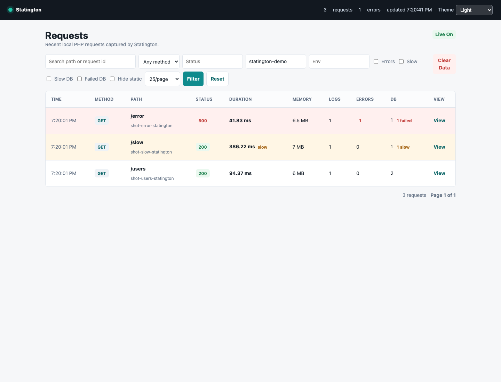
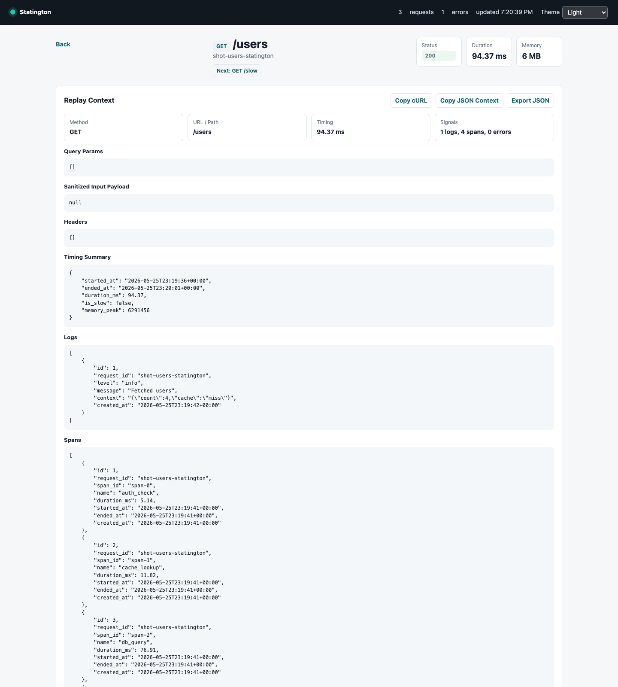
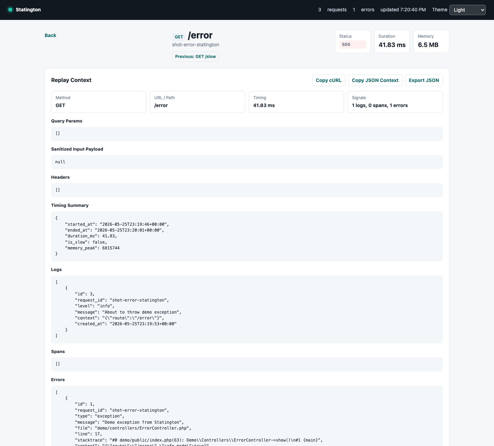

# Statington

Debug PHP apps in real time. Locally. Instantly.

Drop in one line (or a few) and see requests, logs, errors, and spans in a local dashboard.

```bash
composer config repositories.statington vcs https://github.com/trafficinc/statington.git
composer require statington/statington:dev-main
```

```php
use Statington\Statington;

Statington::install();
```

```bash
vendor/bin/statington serve
```

Run it in the background when you want the terminal back:

```bash
vendor/bin/statington serve --background
vendor/bin/statington stop
```

Then open:

```text
http://localhost:8123
```

## Why Statington?

PHP debugging still often means `var_dump`, scattered log files, and a lot of guesswork.

Statington gives you a local dashboard for request visibility while you build. You can see what happened in a request, which logs were written, which spans ran, which errors fired, and what sanitized context was captured.

No SaaS required. No heavy APM agent. No framework lock-in.

It is local-first debugging visibility for PHP apps.

## Features

- Request tracking
- Structured logs
- Error capture
- Manual spans
- Slow request highlighting
- Local SQLite storage
- Request replay context
- Optional database impact tracking
- Plain PHP support
- Framework middleware support

## Quick Start

Install the package:

```bash
composer config repositories.statington vcs https://github.com/trafficinc/statington.git
composer require statington/statington:dev-main
```

Statington is currently installed from GitHub. After it is published on Packagist, this becomes:

```bash
composer require statington/statington
```

Add Statington near the start of your app:

```php
<?php

require __DIR__ . '/vendor/autoload.php';

use Statington\Statington;

Statington::install();
```

Start the local collector and dashboard:

```bash
vendor/bin/statington serve
```

Open the dashboard:

```text
http://localhost:8123
```

Useful CLI commands:

```bash
vendor/bin/statington status
vendor/bin/statington stop
vendor/bin/statington clear
vendor/bin/statington config:publish
vendor/bin/statington demo
```

## Logging

Send structured logs from anywhere in your app:

```php
Statington::log("User login failed", [
    "user_id" => 42,
    "reason" => "invalid_password",
], "warning");
```

Logs are grouped under the current request in the dashboard.

## Spans

Wrap work you want to see on the request timeline:

```php
Statington::span("db_query", function () {
    // query database
});
```

Manual spans are also supported:

```php
$span = Statington::startSpan("external_api");

try {
    // call service
} finally {
    $span->end();
}
```

## Error Capture

Statington captures PHP warnings/errors, uncaught exceptions, and fatal errors automatically after `Statington::install()`.

Fatal errors still send a final `request_end` event when PHP allows shutdown handlers to run, so failed requests show up in the dashboard with status `500`.

## Dashboard Screenshots

Requests:



Request detail:



Error view:



## Demo App

Run the collector:

```bash
php bin/statington serve
```

In another terminal, run the demo app:

```bash
php -S localhost:8080 demo/public/index.php
```

Open a few routes:

```text
http://localhost:8080/users
http://localhost:8080/db-impact
http://localhost:8080/db-select
http://localhost:8080/login-fail
http://localhost:8080/redacted?token=demo-token&api_key=demo-key&safe=visible
http://localhost:8080/slow
http://localhost:8080/error
http://localhost:8080/fatal
```

Then view the captured requests:

```text
http://localhost:8123
```

## Request Replay Context

Request Replay Mode is a debugging-context viewer.

Open any request and use:

- `Copy cURL` to copy a safe local cURL command
- `Copy JSON Context` to copy the sanitized request bundle

This is not full HTTP replay yet. It gives you the method, path, query params, sanitized input payload, headers, logs, spans, errors, and timing summary for a request.

Sensitive headers like `Authorization` and `Cookie` are skipped from generated cURL commands by default.

## Database Impact

Database Impact is optional and off by default.

It answers a simple debugging question:

> What did this request change in my database?

Enable it when you want request-scoped mutation visibility:

```php
Statington::install([
    "db" => [
        "enabled" => true,
        "driver" => "mysql", // mysql | sqlite | pgsql | sqlsrv | other
        "capture_queries" => true,
        "capture_bindings" => false,
        "redact_bindings" => true,
        "track_mutations_only" => true,
        "ignore_tables" => ["sessions", "sessions*", "cache", "cache_*", "jobs", "migrations"],
        "slow_query_ms" => 50,
        "capture_source" => true,
        "source_root" => dirname(__DIR__),
        "source_paths" => ["app", "Modules"],
        "ignore_source_paths" => ["vendor", "bootstrap", "public", "storage", "server", "dashboard", "tests"],
        "ignore_source_classes" => ["Statington\\", "PDO", "PDOStatement"],
    ],
]);
```

For PDO apps, wrap your connection. This works with SQLite, MySQL, and other PDO drivers because Statington sits around PDO instead of replacing your database driver.

Set `db.driver` explicitly. Statington does not guess which database you use. When `driver` is `null`, Statington still records raw SQL, duration, and affected rows, but skips driver-specific table extraction.

### Correct Query Source Detection

If your app is served from `public/index.php`, set `db.source_root` to your project root. Otherwise query source detection may only show the front controller.

```php
"db" => [
    "capture_source" => true,
    "source_root" => dirname(__DIR__),
    "source_paths" => ["app", "Modules"],
    "ignore_source_paths" => ["vendor", "bootstrap", "public", "storage"],
]
```

Database Impact can also skip noisy tables and flag slow queries:

```php
"db" => [
    "ignore_tables" => ["sessions", "sessions*", "cache", "cache_*", "jobs", "migrations"],
    "slow_query_ms" => 50,
]
```

```php
$pdo = Statington::wrapPdo(new PDO($dsn, $user, $password));

$stmt = $pdo->prepare("UPDATE users SET name = :name WHERE id = :id");
$stmt->execute([
    "name" => "Ada",
    "id" => 42,
]);
```

SQLite example:

```php
$pdo = Statington::wrapPdo(new PDO("sqlite::memory:"));
$pdo->exec("CREATE TABLE users (id INTEGER PRIMARY KEY, name TEXT)");
$pdo->prepare("INSERT INTO users (name) VALUES (:name)")
    ->execute(["name" => "Ada"]);
```

MySQL example:

```php
$pdo = Statington::wrapPdo(new PDO(
    "mysql:host=127.0.0.1;dbname=app;charset=utf8mb4",
    "app",
    "secret"
));

$pdo->prepare("UPDATE `users` SET `login_count` = `login_count` + 1 WHERE `id` = :id")
    ->execute(["id" => 42]);
```

You can also record queries manually from framework listeners:

```php
Statington::recordQuery(
    sql: $sql,
    bindings: $bindings,
    durationMs: $durationMs,
    affectedRows: $affectedRows,
);
```

The dashboard shows a `Database Impact` section on the request detail page with grouped table/operation counts, slow query highlighting, query errors, affected rows, duration, source file/line, SQL, and optional bindings.

Bindings are hidden unless `db.capture_bindings` is enabled. When bindings are captured, `db.redact_bindings` controls whether values are replaced with `[REDACTED]`. Leave it on for safer local debugging; turn it off only when you need to inspect actual bound values.

See:

- `examples/database-impact.php` for SQLite
- `examples/database-impact-mysql.php` for MySQL
- `examples/wayfinder.php` for Wayfinder / Research Capture

## Configuration

Statington ships with defaults in:

```text
config/statington.php
```

For local overrides inside this repository, create:

```text
config/statington.local.php
```

That file is ignored by git.

Config load order:

1. Package defaults: `config/statington.php`
2. Local repo override: `config/statington.local.php`
3. App override: `<cwd>/config/statington.php` or `<cwd>/statington.php`
4. Runtime override: values passed to `Statington::install([...])`

Publish a project-local config file with:

```bash
vendor/bin/statington config:publish
```

Or configure Statington in code before install:

```php
Statington::configure([
    "app" => "my-app",
    "ignore_paths" => ["/favicon.ico", "/assets/*"],
]);

Statington::install();
```

Available options:

```php
Statington::install([
    "app" => "my-app",
    "enabled" => true,
    "environment" => "local",
    "endpoint" => "http://localhost:8123",
    "capture_input" => true,
    "capture_headers" => true,
    "slow_request_ms" => 200,
    "max_context_bytes" => 65536,
    "max_body_bytes" => 65536,
    "max_stacktrace_bytes" => 131072,
    "ignore_paths" => [
        "/favicon.ico",
        "/assets/*",
        "/build/*",
        "/health",
    ],
    "db" => [
        "enabled" => false,
        "driver" => null,
        "capture_queries" => true,
        "capture_bindings" => false,
        "redact_bindings" => true,
        "track_mutations_only" => true,
        "max_query_bytes" => 8192,
        "ignore_tables" => ["sessions", "sessions*", "cache", "cache_*", "jobs", "migrations"],
        "slow_query_ms" => 50,
        "capture_source" => true,
        "source_root" => null,
        "source_paths" => ["app", "Modules"],
        "ignore_source_paths" => ["vendor", "bootstrap", "public", "storage", "server", "dashboard", "tests"],
        "ignore_source_classes" => ["Statington\\", "PDO", "PDOStatement"],
    ],
]);
```

Config options:

- `app`: Application name shown in the dashboard.
- `enabled`: Enables or disables event capture.
- `environment`: Environment name, usually `local`, `dev`, or `testing`.
- `endpoint`: Local collector URL.
- `capture_input`: Captures query, POST, and body payloads when enabled.
- `capture_headers`: Captures request headers when enabled.
- `slow_request_ms`: Threshold for slow request highlighting.
- `max_context_bytes`: Maximum size for log/context values.
- `max_body_bytes`: Maximum size for captured request bodies.
- `max_stacktrace_bytes`: Maximum size for captured stack traces.
- `ignore_paths`: Request paths to skip entirely. Supports exact matches and `*` wildcards.
  Statington defaults include common browser/static noise such as `/favicon.ico`, `/robots.txt`, `/assets/*`, and `/build/*`.
- `db`: Optional Database Impact settings. Set `db.driver` explicitly, for example `mysql` or `sqlite`. Other drivers can be added later without changing the config shape.
- `db.redact_bindings`: Replaces captured database binding values with `[REDACTED]` when enabled.
- `db.ignore_tables`: Table names to skip from Database Impact when all detected tables are ignored. Supports `*` wildcards such as `sessions*` and `cache_*`.
- `db.slow_query_ms`: Threshold for slow query highlighting in Database Impact.
- `db.capture_source`: Captures the best matching app file and line for each recorded query.
- `db.source_root`: Project root used to make query source paths relative. Set this explicitly for apps served from `public/`.
- `db.source_paths`: App-relative directories Statington should prefer when finding query source frames.
- `db.ignore_source_paths`: App-relative directories Statington should skip when finding query source frames.
- `db.ignore_source_classes`: Class names or prefixes Statington should skip when finding query source frames.

Sensitive keys are redacted recursively by default.

## Framework Support

Framework support is intentionally lightweight.

Statington works automatically with plain PHP through `Statington::install()`. For frameworks, use explicit request mode inside middleware. These snippets are copy-paste starting points and do not require Statington to depend on Laravel, Symfony, Slim, or PSR packages.

### Laravel Middleware

```php
<?php

use Closure;
use Statington\Statington;
use Throwable;

final class StatingtonMiddleware
{
    public function handle($request, Closure $next)
    {
        Statington::configure([
            'app' => env('APP_NAME', 'laravel-app'),
            'environment' => env('APP_ENV', 'local'),
            'endpoint' => env('STATINGTON_ENDPOINT', 'http://localhost:8123'),
        ]);

        Statington::startRequest([
            'method' => $request->method(),
            'uri' => $request->fullUrl(),
            'path' => $request->path(),
        ]);

        try {
            $response = $next($request);
            Statington::finishRequest($response->getStatusCode());

            return $response;
        } catch (Throwable $e) {
            Statington::captureException($e);
            Statington::finishRequest(500);

            throw $e;
        }
    }
}
```

## Or Laravel to track database queries too

```In app/Providers/AppServiceProvider.php```

```php
<?php
...
class AppServiceProvider extends ServiceProvider
{
  public function boot(): void {
    Statington::configure([
        'app' => config('app.name', 'Your App Name'),
        'environment' => app()->environment(),
        'endpoint' => env('STATINGTON_ENDPOINT', 'http://localhost:8123'),
        'db' => [
            'enabled' => true,
            'driver' => 'mysql',
            'capture_queries' => true,
            'capture_bindings' => true,
            'redact_bindings' => false,
            'track_mutations_only' => false,
            'slow_query_ms' => 50,
            'source_root' => base_path(),
            'source_paths' => ['app'],
            'ignore_tables' => ['sessions', 'cache', 'cache_*', 'jobs', 'migrations'],
        ],
    ]);

    DB::listen(function ($query): void {
        Statington::recordQuery(
            sql: $query->sql,
            bindings: $query->bindings,
            durationMs: $query->time,
        );
    });
  }
}
```


### Symfony Event Subscriber

```php
<?php

use Statington\Statington;
use Throwable;

final class StatingtonEventSubscriber
{
    public static function getSubscribedEvents(): array
    {
        return [
            'kernel.request' => 'onKernelRequest',
            'kernel.response' => 'onKernelResponse',
            'kernel.exception' => 'onKernelException',
        ];
    }

    public function onKernelRequest($event): void
    {
        $request = $event->getRequest();

        Statington::configure([
            'app' => $_ENV['APP_NAME'] ?? 'symfony-app',
            'environment' => $_ENV['APP_ENV'] ?? 'dev',
            'endpoint' => $_ENV['STATINGTON_ENDPOINT'] ?? 'http://localhost:8123',
        ]);

        Statington::startRequest([
            'method' => $request->getMethod(),
            'uri' => $request->getUri(),
            'path' => $request->getPathInfo(),
        ]);
    }

    public function onKernelResponse($event): void
    {
        Statington::finishRequest($event->getResponse()->getStatusCode());
    }

    public function onKernelException($event): void
    {
        Statington::captureException($event->getThrowable());
        Statington::finishRequest(500);
    }
}
```

### Slim Middleware

```php
<?php

use Statington\Statington;
use Throwable;

$statingtonMiddleware = function ($request, $handler) {
    Statington::configure([
        'app' => $_ENV['APP_NAME'] ?? 'slim-app',
        'environment' => $_ENV['APP_ENV'] ?? 'dev',
        'endpoint' => $_ENV['STATINGTON_ENDPOINT'] ?? 'http://localhost:8123',
    ]);

    Statington::startRequest([
        'method' => $request->getMethod(),
        'uri' => (string) $request->getUri(),
        'path' => $request->getUri()->getPath(),
    ]);

    try {
        $response = $handler->handle($request);
        Statington::finishRequest($response->getStatusCode());

        return $response;
    } catch (Throwable $e) {
        Statington::captureException($e);
        Statington::finishRequest(500);

        throw $e;
    }
};

// $app->add($statingtonMiddleware);
```

### Raw PHP Front Controller

Put this near the top of `public/index.php` before your router runs:

```php
<?php

require __DIR__ . '/../vendor/autoload.php';

use Statington\Statington;
use Throwable;

Statington::install([
    'app' => 'my-php-app',
]);

try {
    require __DIR__ . '/../app/router.php';
} catch (Throwable $e) {
    Statington::captureException($e);
    Statington::finishRequest(500);

    throw $e;
}
```

Full examples:

- `examples/vanilla.php`
- `examples/laravel.php`
- `examples/symfony.php`
- `examples/slim.php`
- `examples/wayfinder.php`

Tiny opt-in bridge classes are also available under `Statington\Framework\*`. They avoid framework dependencies and are meant as copyable adapters, not required integrations.

### Laravel Database Impact

Use Laravel's query listener from a service provider:

```php
use Illuminate\Support\Facades\DB;
use Statington\Statington;

DB::listen(function ($query): void {
    Statington::recordQuery(
        sql: $query->sql,
        bindings: $query->bindings,
        durationMs: $query->time,
    );
});
```

### Doctrine DBAL Database Impact

For Doctrine DBAL, wrap query execution with middleware or your repository/service boundary and record success or failure:

```php
use Statington\Statington;

$started = microtime(true);

try {
    $result = $connection->executeQuery($sql, $params);
    Statington::recordQuery($sql, $params, (microtime(true) - $started) * 1000);
    return $result;
} catch (Throwable $e) {
    Statington::recordQueryError($sql, $params, $e, (microtime(true) - $started) * 1000);
    throw $e;
}
```

## Testing

The repository keeps the simple runner for environments without dev dependencies:

```bash
composer test
```

A PHPUnit suite is scaffolded for normal package development:

```bash
composer install
composer test:unit
```

## Production Warning

Statington is designed for local development.

Do not capture sensitive production traffic unless you explicitly configure it, understand the risks, and have reviewed sanitization settings.

`Statington::auto()` does not run in production. `Statington::install()` only runs in production when `enabled` is explicitly `true`.

## Roadmap

- Laravel package
- Symfony bundle
- Better charts
- Export request bundle
- Real request replay
- Optional event batching if local transport overhead becomes noticeable
- Docker helper
- PHAR distribution

## License

MIT
